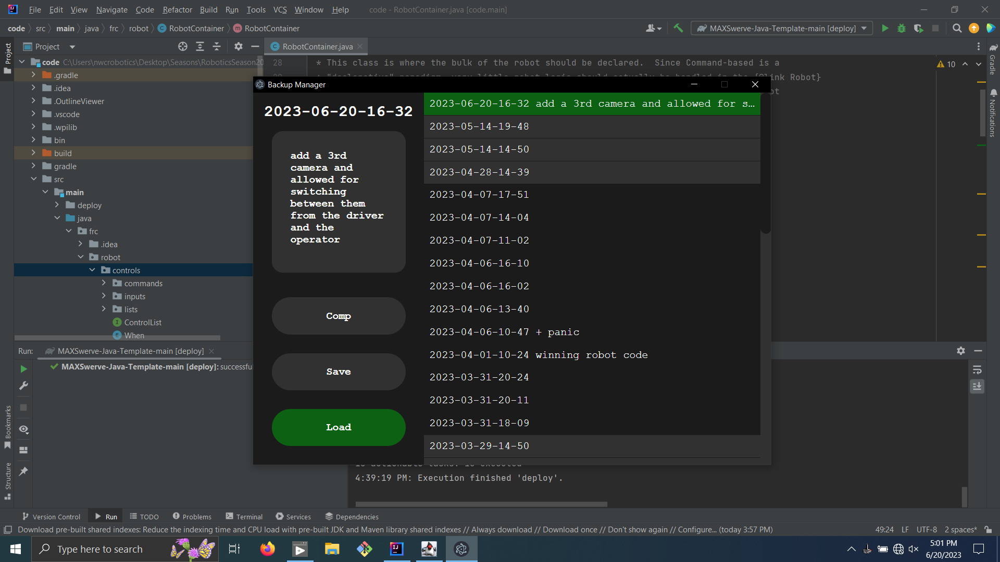

# BackupManager

## Easy Install
Coming Soon
## Manual Install
### 1. Clone this repository
### 2. Create a backups folder
This folder will contain all of the previous code versions.
### 3. Fill out config.json
```json
{
	"backupsFile": "PATH TO BACKUPS.JSON",
	"backupsDir": "BACKUPS DIRECTORY CREATED IN STEP TWO",
	"codeDir": "PATH TO YOUR ROBOT'S CODE FOLDER"
}
```
The code folder should be something like ```src/main/java/frc``` for teams using Java.
Other folders may work as long as they contain the code and stay consistent.
### Install the dependencies
Assuming you have [NodeJS](https://nodejs.org) installed, type the command ```npm i``` into your terminal.
### Build the Executable
Next run the command ```npm run make``` to build your executable.
